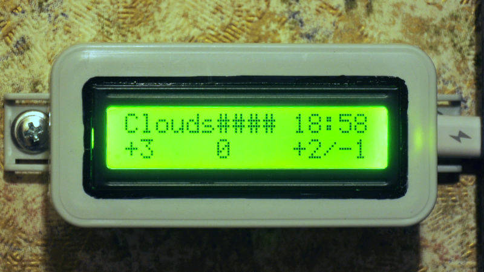

# weather-informer
Wi-Fi ESP32 based device which get and display weather information:

Weather phenomena, current temp, feels-like temp, forecast and sharp time synced via SNTP

Check out [weather-backend](https://github.com/root4root/weather-backend) API to find out where the actual data comes from

